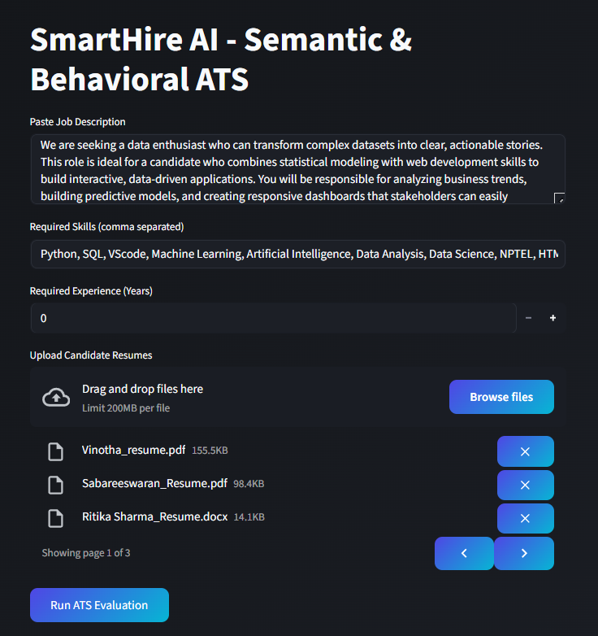

# **SmartHireAI - Semantic & Behavioral ATS with Fraud Detection and LLM Decision**

## **Introduction**

Recruiting top talent efficiently is a critical challenge for modern organizations. Traditional ATS systems often rely on keyword matching alone, leading to missed high-potential candidates or false positives due to keyword stuffing and resume manipulations.

SmartHireAI is an AI-driven multi-agent recruitment system that combines semantic analysis, hybrid scoring, behavioral evaluation, and fraud detection to assess candidate resumes against job descriptions accurately. It automates shortlisting, highlights skill gaps, detects fraudulent resume patterns, and provides a robust decision-making pipeline enhanced with a borderline LLM intelligence layer.

## **Problem Statement**

Organizations face challenges such as:
 - Candidates stuffing resumes with irrelevant keywords to bypass automated systems.
 - Difficulty in evaluating resumes beyond simple keyword matching.
 - Lack of holistic candidate scoring considering experience, context, and semantic relevance.
 - No automated mechanism to detect hidden, invisible, or manipulated content in resumes.
 - Need for real-time candidate evaluation combined with email notifications for HR efficiency.

SmartHireAI addresses these gaps with an end-to-end intelligent evaluation system, ensuring accurate shortlisting while flagging fraudulent or poorly formatted resumes.

## **Multi-Agent System Overview**

SmartHireAI adopts a multi-agent architecture, where each agent has a specialized role:
 - **Resume Agent** – Preprocesses and cleans candidate resumes, extracts emails, names, and relevant information.
 - **Fraud Agent** – Detects repeated keyword stuffing, continuous keyword blocks, hidden or invisible text in PDFs.
 - **Scoring Agent** – Computes a hybrid score using keyword matching, context-based scoring, semantic similarity via RAG-style retrieval, and experience evaluation.
 - **Decision Agent** – Determines candidate status using a rule-based system (fraud > skill threshold > insufficient match).
 - **LLM Agent** – Provides borderline candidate override using Groq LLM API.
 - **Email Agent** – Sends automated notifications to candidates with results and feedback.

This modular architecture ensures scalability, explainability, and precise automation, mimicking human recruitment workflows with AI accuracy.

## **System Architecture & Workflow**

1. Resume Preprocessing
    - Resumes are cleaned, normalized, and prepared for analysis.
2. Candidate Information Extraction
    - Emails and candidate names are extracted intelligently.
3. Fraud Detection Layer
    - Keyword stuffing, repeated patterns, hidden/invisible content in PDFs is flagged.
4. Scoring Layer (Hybrid + RAG)
    - Keyword and context scoring.
    - Semantic similarity calculated using RAG-style retrieval of the most relevant resume sentences against the job description.
    - Experience is extracted and factored into scoring.
5. Rule-Based Decision Making
    - Candidates are shortlisted or rejected based on fraud detection and scoring thresholds.
6. LLM Borderline Decision
    - Low-to-mid scoring candidates receive an AI review using Groq LLM for a final override.
7. Skill Gap Feedback
    - Rejected candidates are provided with skill gap insights.
8. Email Notification
    - Automated candidate communication triggered with personalized feedback.
  
## **Technology Stack**

- **Programming Language:** Python 3.11+
- **Frontend & Visualization:** Streamlit + Plotly
- **Database:** SQLite (`smarthire.db`) for storing resumes and evaluation data
- **NLP & AI:**
  - `sentence-transformers` for semantic similarity scoring
  - Custom keyword + context scoring logic
  - **RAG-style retrieval** for top relevant resume chunks
  - **LLM (Groq API)** for borderline candidate evaluation
- **Resume Parsing:** `pdfplumber`, `python-docx`, `pdfminer.six`
- **Fraud Detection:** `PyMuPDF` + PDF heuristics for hidden/invisible text and repeated keywords
- **Email Notifications:** `smtplib` with secure environment variables

## **Key Features**

- **Hybrid Scoring:** Combines keyword, context, experience, and semantic similarity for robust evaluation.
- **RAG-style Relevance:** Focused semantic analysis on top resume chunks for precise matching.
- **Fraud Detection:** Identifies hidden text, repeated keyword spam, and invisible content in resumes.
- **LLM Intelligence Layer:** Borderline candidate override using AI for nuanced decision-making.
- **Email Automation:** Sends candidate notifications directly from the system.
- **Interactive Dashboard:** Displays evaluation metrics, score distributions, and candidate insights.

## **ATS Dashboard Preview**

### **1. Input Section**

This section allows HR to provide the Job Description, required skills, and minimum experience, and upload multiple candidate resumes. Once submitted, the system automatically evaluates all candidates.

  

### **2. Candidate Evaluation Table**

Displays all candidates with:
 - **Score** – combined evaluation of skills, experience, and semantic matching
 - **Experience** – extracted from resumes
 - **Fraud** – flags for repeated keywords or hidden text
 - **Status** – Shortlisted or Rejected
 - **Reason** – explanation for rejection or skill gaps

  

### **3. Candidate Distribution**

A *donut chart* showing the overall evaluation outcome:
 - **Shortlisted** – candidates meeting requirements.
 - **Skill Gap** – rejected due to missing skills.
 - **Fraud Detected** – flagged for manipulative content.
Gives an instant overview of candidate quality.

  

### 4. **Candidate Score Comparison**

A *bar chart* comparing candidate scores against the selection threshold:
 - Highlights top performers and borderline candidates.
 - Helps HR prioritize interviews efficiently.

  

### **5. Score Distribution**

A *histogram* showing the spread of candidate scores across ranges (0–20, 21–40, etc.):
 - Visualizes the proportion of weak, average, and strong candidates.
 - Supports data-driven decision-making for large applicant pools.

  

## **Conclusion**

SmartHireAI offers a next-generation recruitment pipeline, combining semantic evaluation, behavioral scoring, RAG-enhanced assessment, fraud detection, and LLM decision support. It ensures fair, transparent, and efficient candidate shortlisting, reducing HR workload while improving hiring accuracy.

## **AUTHOR✍🏼**
**OVIYA MAHESWARI N**
